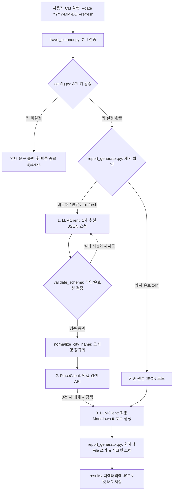
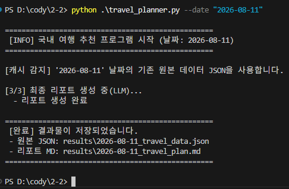
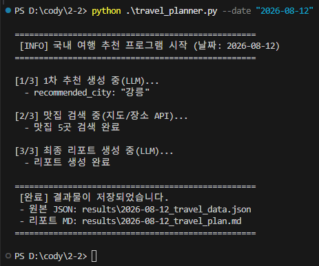
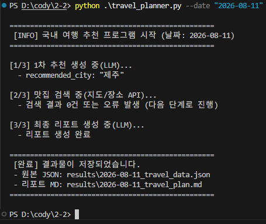
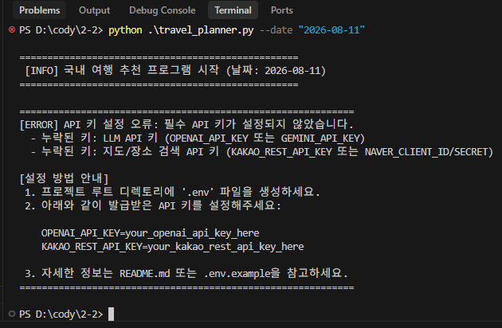

# 국내 여행지 추천 및 맛집 정보 연동 CLI 프로그램

본 프로젝트는 **LLM API**(OpenAI / Google Gemini)와 **지도/장소 검색 API**(Kakao Local / Naver Local Search)를 연동하여, 사용자가 입력한 여행 날짜(`-date YYYY-MM-DD`)에 맞는 추천 여행지, 날씨, 축제 정보 및 맛집 목록을 종합한 **원본 JSON 데이터**와 **최종 마크다운 리포트**를 자동 생성하는 CLI 응용 프로그램입니다.

---

## 📌 1. 프로그램 개요 및 모듈 데이터 흐름 (Architecture)

### 1.1. 시스템 아키텍처 다이어그램 (PASS #6 보완)



### 1.2. 핵심 제공 기능
- **CLI 기반 인터페이스**: `argparse`를 활용하여 `-date "YYYY-MM-DD"` 형태의 날짜 입력을 받아 검증하며, `--refresh` 옵션으로 캐시 강제 갱신을 지원합니다.
- **다중 API 연동 파이프라인**:
  1. **LLM 1차 호출**: 추천 도시, 날씨 요약, 축제 정보, 추천 근거를 수집하고 **정밀 스키마 타입 검증**(`validate_schema`) 수행
  2. **도시명 정규화 모듈**: 지명 수식어 정제 및 별칭 매핑(`normalize_city_name`)
  3. **지도/장소 API 호출**: 맛집 5곳 검색 (0건 시 대체 키워드 자동 재검색 및 지수 백오프 재시도)
  4. **LLM 2차 호출**: 최종 **Markdown 여행 리포트** 작성
- **보안 및 장애 대처(Fault Tolerance)**:
  - API 키 미설정 시 가이드 출력 후 빠른 종료 (`sys.exit(1)`)
  - LLM JSON 파싱 및 타입 오류 시 자동 1회 재시도 (Retry)
  - 지도 API 인증 오류(401/403) 또는 검색 결과 0건 시, 중단 없이 `데이터 없음` 처리 후 타임스탬프와 심각도가 포함된 구조화된 `errors` 기록
  - 저장 전 2차 시크릿 스캐너 적용 및 원자적(Atomic) 파일 저장 지원
- **결과 캐싱 (보너스 과제)**: 24시간 TTL 기반 캐싱 및 `--refresh` 옵션을 지원합니다.

---

## 🛠️ 2. 개발 및 실행 환경

- **언어**: Python 3.10 이상
- **의존성 라이브러리**:
  - `python-dotenv`: `.env` 파일 기반 환경변수 로드
  - `requests`: 지도/장소 REST API 및 Gemini API HTTP 통신
  - `openai`: OpenAI GPT API 연동 (선택)

---

## 🔑 3. API 키 설정 방법 및 보안 관리 정책

> [!CAUTION]
> **보안 관리 정책**: API 키를 소스코드, README, Public Git 저장소에 절대로 노출하지 마세요. 과금 방지 및 개인정보 보호를 위해 반드시 `.env` 파일로 관리하며, `.gitignore`에 등록되어 있습니다.

### 3.1. 환경 변수 설정 방법
1. 프로젝트 루트에 `.env` 파일을 생성합니다 (또는 `.env.example` 복사).
2. 발급받은 API 키를 설정합니다:

```env
# LLM API 키 (OpenAI 또는 Gemini 중 1개 선택 설정)
# OPENAI_API_KEY=your_openai_api_key_here
GEMINI_API_KEY=your_gemini_api_key_here

# Gemini LLM 모델 지정 (기본값: gemini-flash-lite-latest)
# GEMINI_MODEL=gemini-flash-lite-latest

# 지도/장소 검색 API 키 (Kakao 또는 Naver 중 1개 선택 설정)
KAKAO_REST_API_KEY=your_kakao_rest_api_key_here
# NAVER_CLIENT_ID=your_naver_client_id_here
# NAVER_CLIENT_SECRET=your_naver_client_secret_here
```

### 3.2. 운영 환경(Production) 보안 관리 권장사항 (PASS #13 보완)
실무 배포 및 대규모 운영 환경에서는 `.env` 파일 방식 외에 다음과 같은 엔터프라이즈 비밀 관리(Secrets Manager) 시스템 연동을 권장합니다:
- **AWS Secrets Manager** / **GCP Secret Manager**: 중앙 집중식 키 관리 및 키 자동 순환(Rotation) 정책 적용
- **HashiCorp Vault**: 동적 자격 증명 발급 및 상세 감사 로그(Audit Log) 추적

---

## 🌐 4. REST API HTTP 메서드 및 연동 예시 (PASS #10 보완)

본 프로그램은 API의 목적과 데이터 전달 특성에 맞춰 적절한 HTTP 메서드(GET/POST)를 선택하여 사용합니다.

### 4.1. 장소 검색 API (GET 메서드 사용)
- **선택 이유**: 서버의 상태를 변경하지 않고 주어진 키워드(도시명)로 장소 정보를 조회(Read)하는 리소스 검색 목적이므로 `GET` 메서드를 사용합니다.
- **cURL 예시 (Kakao Local API)**:
```bash
curl -X GET "https://dapi.kakao.com/v2/local/search/keyword.json?query=%EA%B0%95%EB%A5%A5%20%EB%A7%9B%EC%A7%91&size=5" \
  -H "Authorization: KakaoAK YOUR_KAKAO_REST_API_KEY"
```

### 4.2. LLM 생성 API (POST 메서드 사용)
- **선택 이유**: 프롬프트 및 시스템 지시사항 등 대용량 데이터 페이로드를 요청 본문(Body)에 포함하고, AI 모델에 복잡한 추론 및 생성 작업을 가공 요청하므로 `POST` 메서드를 사용합니다.
- **cURL 예시 (Google Gemini API)**:
```bash
curl -X POST "https://generativelanguage.googleapis.com/v1beta/models/gemini-flash-lite-latest:generateContent" \
  -H "Content-Type: application/json" \
  -H "X-goog-api-key: YOUR_GEMINI_API_KEY" \
  -d '{
    "contents": [{"parts": [{"text": "여행 날짜: 2026-08-11 추천 리포트 작성"}]}]
  }'
```

---

## 🚀 5. 프로그램 실행 및 미션별 가이드

### 5.1. 기본 실행 방법
```bash
# 기본 실행 방식
python travel_planner.py --date "2026-08-11"

# 캐시 강제 무효화 및 새로운 API 호출 실행 (--refresh 옵션)
python travel_planner.py --date "2026-08-11" --refresh
```

### 5.2. 미션 1: 정상 CLI 실행 및 API 조합 파이프라인 (Pass 1)


### 5.3. 미션 2: 결과 캐싱 및 24h TTL 최적화 (Pass 2 - 보너스 과제)


### 5.4. 미션 3: CLI 입력 검증 및 API 키 미설정 예외 처리


### 5.5. 미션 4: 외부 API 연동 오류 핸들링 및 유연한 복구 (Fault Tolerance)


---

## 💡 6. 데이터 정규화 및 품질 검증 정책

### 6.1. 도시명 입력 정규화 (FAIL #17 보완)
`place_client.py`의 `normalize_city_name()` 함수를 통해 LLM이 출력한 도시명 입력의 불필요한 행정구역 수식어나 별칭을 정제하여 장소 검색 정확도를 대폭 향상시켰습니다:
- **별칭 매핑**: `"제주특별자치도"` / `"제주도"` $\rightarrow$ `"제주"`, `"서울특별시"` $\rightarrow$ `"서울"`, `"부산광역시"` $\rightarrow$ `"부산"`
- **행정구역 수식어 분해**: `"강원도 강릉시"` $\rightarrow$ `"강릉"`, `"경상북도 경주시"` $\rightarrow$ `"경주"`
- **접미사 정제**: `"경주시"` $\rightarrow$ `"경주"`, `"여수시"` $\rightarrow$ `"여수"`

### 6.2. LLM JSON 파싱 및 정밀 스키마 타입 검증 (FAIL #7 & PASS #11 보완)

`llm_client.py`의 `validate_schema()` 함수는 키 존재뿐만 아니라 데이터 타입과 비어있지 않은 값 여부를 정밀하게 체킹합니다.

#### 정상 JSON 구조 예시
```json
{
  "recommended_city": "강릉",
  "weather": "8월 중순의 강릉은 화창하고 무더운 한여름 날씨입니다.",
  "events": [
    "경포 여름바다예술제",
    "강릉 수제맥주 페스티벌"
  ],
  "reason": "8월은 동해 바다를 만끽하기에 가장 좋은 휴가 성수기입니다."
}
```

#### 비정상 파싱/타입 실패 예시 (자동 재시도 유발 대상)
```json
// 오류 사례 1: events가 리스트가 아닌 단일 문자열로 출력된 경우 (Type Error)
{
  "recommended_city": "강릉",
  "weather": "맑음",
  "events": "경포 여름바다예술제", // invalid: list여야 함
  "reason": "추천합니다"
}

// 오류 사례 2: recommended_city가 공백 문자열인 경우 (Validation Error)
{
  "recommended_city": "   ", // invalid: 비어있음
  "weather": "맑음",
  "events": ["축제"],
  "reason": "추천합니다"
}
```

---

## 📂 7. 결과물 데이터 구조 및 확인 (`results/`)

프로그램 실행이 완료되면 `results/` 폴더에 2개의 파일이 저장됩니다.

### 7.1. 원본 데이터 JSON 구조 예시 (`2026-08-11_travel_data.json`)
```json
{
  "date": "2026-08-11",
  "recommendation": {
    "recommended_city": "강릉",
    "weather": "8월 중순의 강릉은 한여름 무더위가 이어지며, 맑고 화창한 날씨와 함께 해수욕을 즐기기 가장 좋은 기온을 보입니다.",
    "events": [
      "경포 여름바다예술제",
      "강릉 수제맥주 페스티벌"
    ],
    "reason": "8월 11일은 본격적인 휴가 성수기 시즌으로 동해안의 에메랄드빛 바다와 송림이 어우러진 경포해변..."
  },
  "restaurants": [
    {
      "name": "9남매두부집",
      "address": "강원특별자치도 강릉시 초당원길 63-2",
      "category": "음식점 > 한식 > 두부전문점",
      "url": "http://place.map.kakao.com/18636898",
      "x": 128.91390117047928,
      "y": 37.786906250322346
    }
  ],
  "errors": [
    {
      "step": "place_search",
      "type": "EMPTY_RESULT",
      "severity": "WARNING",
      "timestamp": "2026-08-11T17:20:00.123456+00:00",
      "message": "0 results for query='오지마을 맛집' (대체 검색 포함)"
    }
  ]
}
```

---

## 🎓 8. 과제 목표 달성 및 학습 정리

본 미션을 통해 아래 핵심 개념과 실무 대처 원칙을 습득하였습니다:

1. **REST API 및 HTTP 메서드 (GET vs POST)**:
   - GET 요청: Kakao/Naver 장소 검색 API 호출 시 쿼리 파라미터를 사용한 데이터 조회
   - POST 요청: OpenAI/Gemini LLM API 호출 시 헤더 인증(`X-goog-api-key`, `Authorization`)과 JSON 페이로드를 전달하여 인공지능 응답 생성
2. **구조화된 출력(JSON)과 정밀 타입 검증 파이프라인**:
   - 비구조적인 LLM 텍스트 응답을 JSON 형식으로 강제 및 정밀 타입 검증(`validate_schema`)을 수행하고, 파이프라인을 통해 정규화된 추천 도시(`normalized_city`)를 다음 단계인 지도 API 맛집 검색 키워드로 연결하는 체인 구성
3. **외부 API 오류 대처 원칙 (Fault Tolerance)**:
   - 인증 오류(401/403), 네트워크 장애, 파싱 실패, 0건 검색 상황에서도 전체 프로그램이 다운되지 않고 폴백(Fallback) 데이터와 `timestamp`, `severity` 메타데이터가 포함된 `errors` 로그를 남기며 최종 리포트를 생성하는 복구력 확보
4. **안전한 원자적 저장 및 자격 증명 보안 관리**:
   - `.tmp` 임시 파일과 `os.replace()`를 활용한 원자적 파일 저장 및 2차 시크릿 스캐너 적용
   - API 키를 코드나 Git 저장소에 하드코딩하지 않고 `.env` 파일과 `.gitignore`로 분리하여 유출 위험 및 기습 과금 차단
